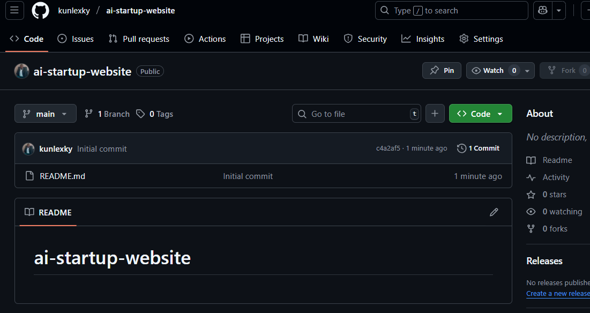
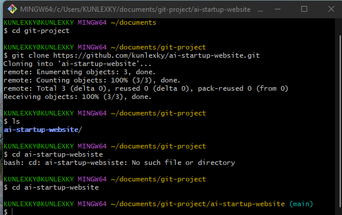
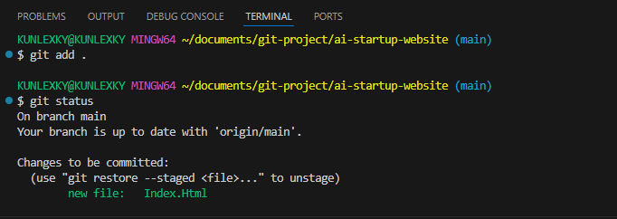
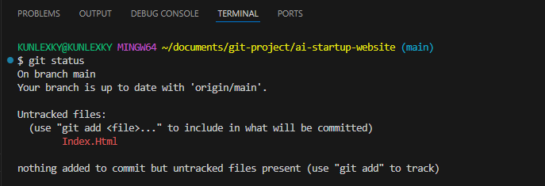
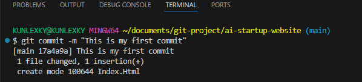
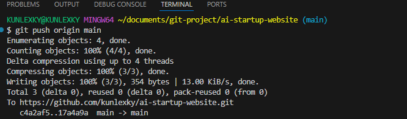
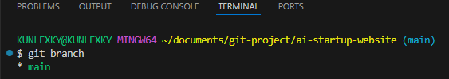
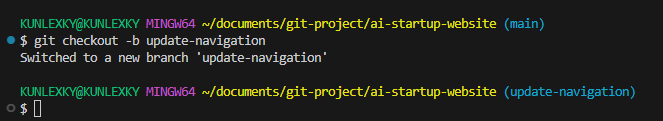

# ai-startup-website

## Installing Git

## New Repository

## Cloning the repository

## Creating index.html file, adding it, commiting it, and pushing it into the remote repository

## Git Branch command

## New Branch for Tom
